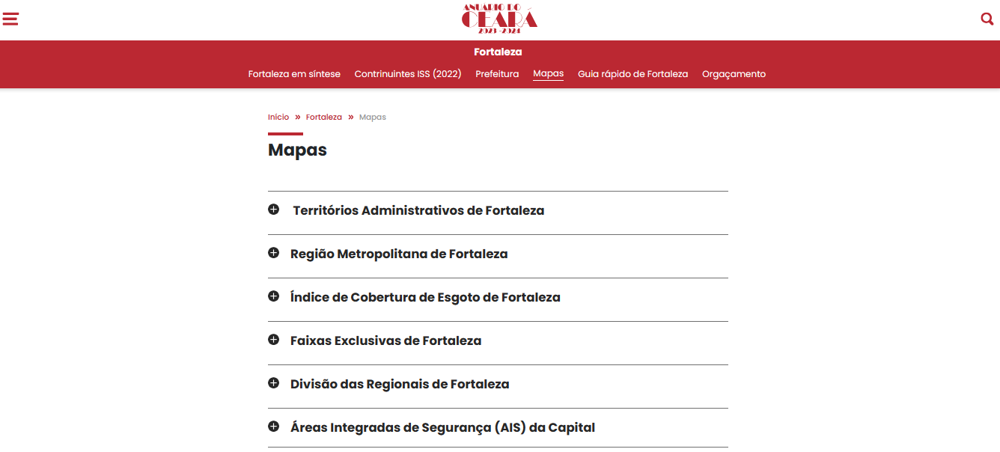

# 📚 Anuário do Ceará

Um projeto web desenvolvido utilizando HTML, CSS e JavaScript, com ênfase em responsividade, utilizando a biblioteca Bootstrap.

[](https://github.com/seu-usuario/anuario-ceara/blob/main/LICENSE)


[](https://github.com/seu-usuario/anuario-ceara/issues)

## 🛠️ Recursos Utilizados

## 🛠️ Recursos Utilizados

### [Bootstrap](https://getbootstrap.com/) 
[](https://getbootstrap.com/)
   - Framework CSS para desenvolvimento ágil e responsivo.

### [jQuery](https://jquery.com/) 
[](https://jquery.com/)
   - Biblioteca JavaScript para manipulação de documentos HTML.

### [jQuery UI](https://jqueryui.com/) 
[](https://jqueryui.com/)
   - Conjunto de widgets interativos, efeitos e temas construídos sobre a biblioteca jQuery.

### HTML
[](https://developer.mozilla.org/en-US/docs/Web/HTML)
   - Linguagem de marcação para a estruturação de páginas web.

### CSS
[](https://developer.mozilla.org/en-US/docs/Web/CSS)
   - Linguagem de estilo para o design e layout de páginas web.

### JavaScript
[](https://developer.mozilla.org/en-US/docs/Web/JavaScript)
   - Linguagem de programação para tornar as páginas web interativas.

### Media Query
[](https://developer.mozilla.org/en-US/docs/Web/CSS/Media_Queries)
   - Recurso do CSS para criar layouts responsivos com base nas características do dispositivo.

## 📸 Captura de Tela



## 📋 Requisitos

- Navegador web moderno
- Conexão com a internet (para carregar recursos externos)

## 🚀 Instalação

1. **Clone o repositório:**

   ```bash
   git clone https://github.com/ryssaes/anuario-ceara.git
